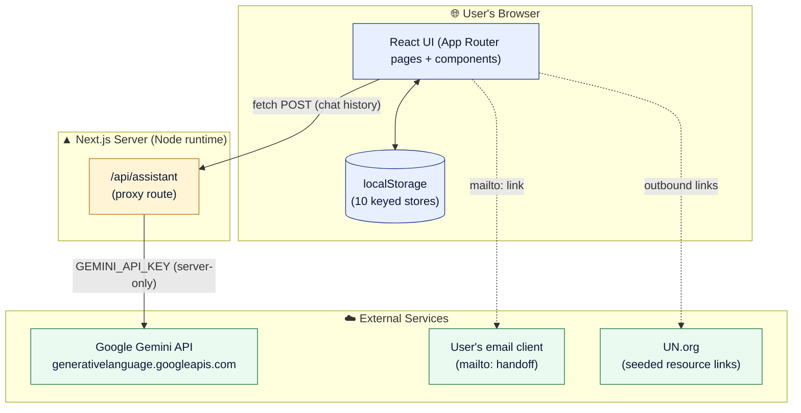
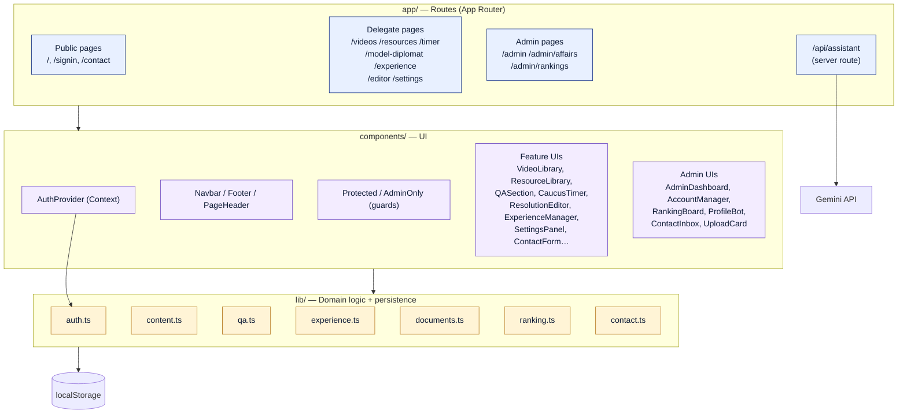
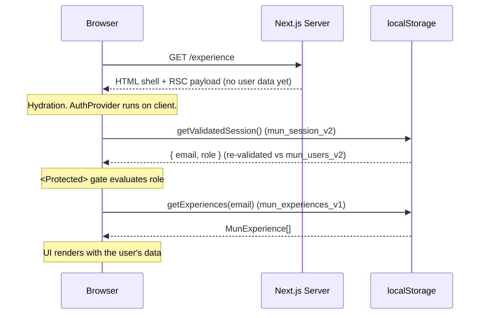
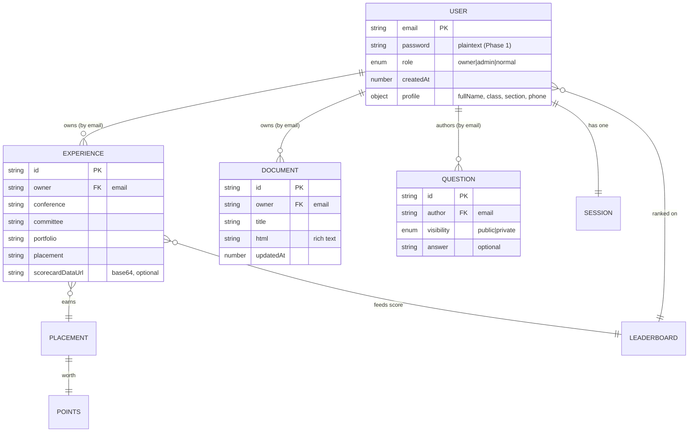
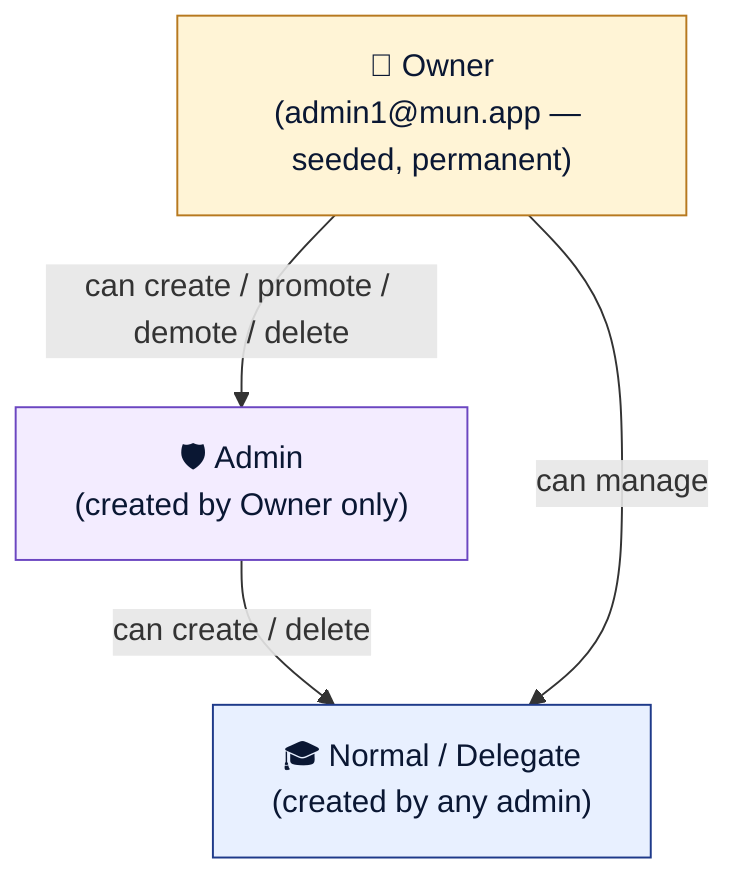
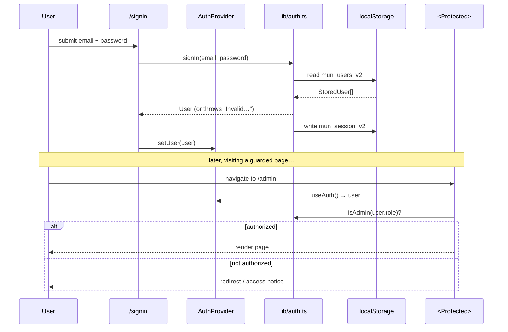
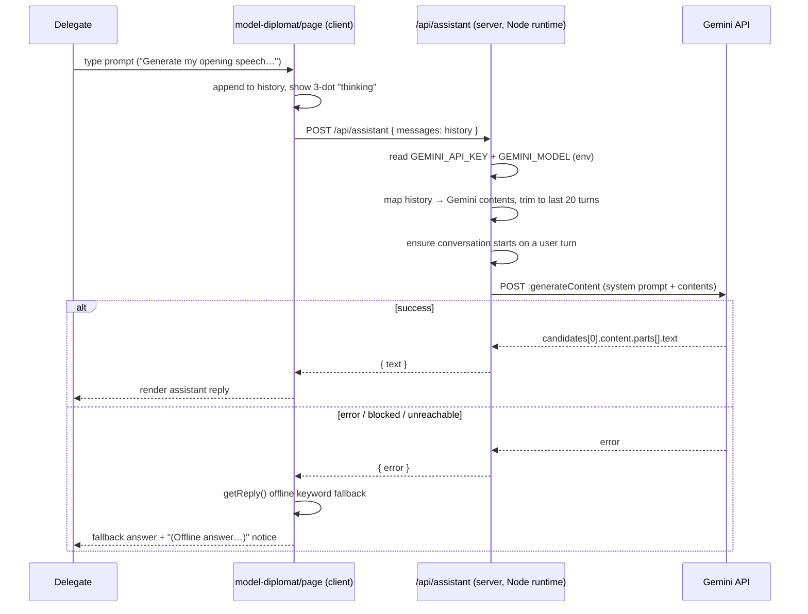
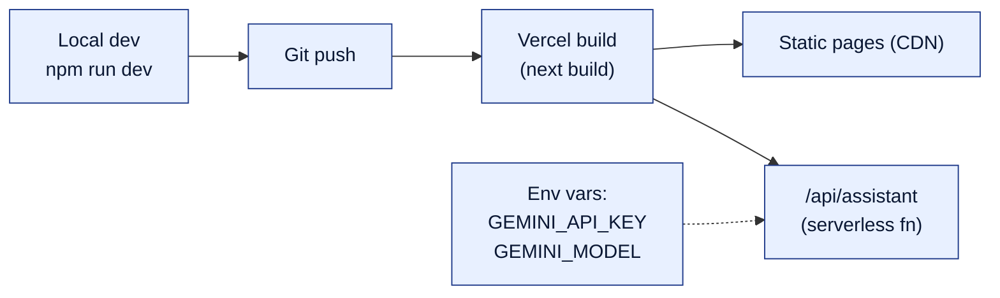
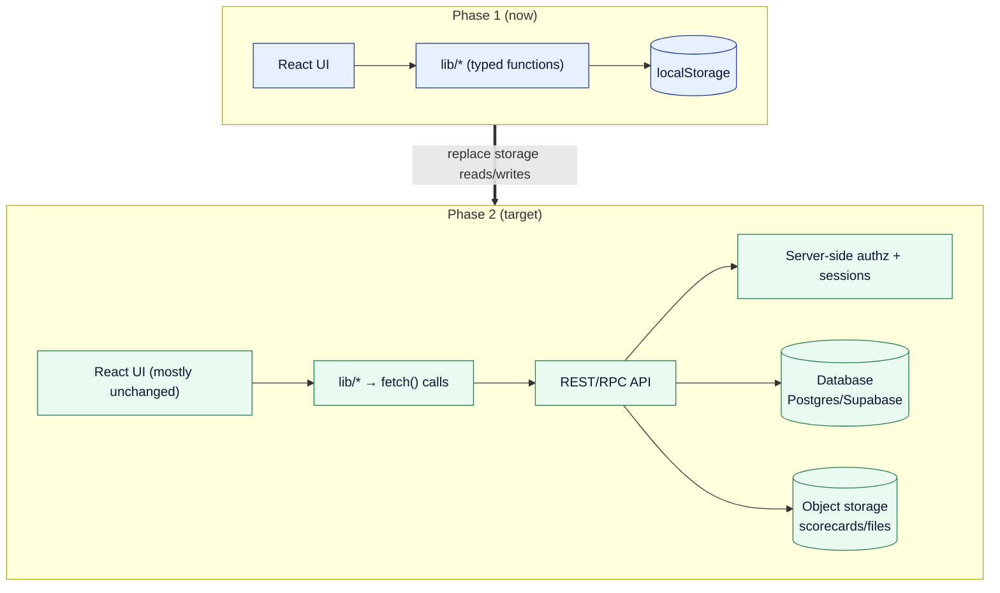

# Let's MUN Platform — Architecture & Production Document

> A learning platform for student diplomats: lessons, resources, caucus timers,
> an AI practice partner, a resolution editor, delegate experience tracking, and
> admin tooling.
>
> **Status:** Phase 1 (client-side prototype) with one real server feature (the
> Gemini-powered MUN Assistant).
> **Last updated:** 2026-06-14

---

## 1. Document map

1. [System overview](#2-system-overview)
2. [Technology stack](#3-technology-stack)
3. [High-level architecture](#4-high-level-architecture)
4. [Request & rendering model](#5-request--rendering-model)
5. [Routes / sitemap](#6-routes--sitemap)
6. [Data model & persistence](#7-data-model--persistence)
7. [Authentication & access control](#8-authentication--access-control)
8. [The MUN Assistant (AI) pipeline](#9-the-mun-assistant-ai-pipeline)
9. [Component inventory](#10-component-inventory)
10. [Security posture & known limitations](#11-security-posture--known-limitations)
11. [Configuration & environments](#12-configuration--environments)
12. [Build, run & deploy](#13-build-run--deploy)
13. [Phase 2 — production migration path](#14-phase-2--production-migration-path)

---

## 2. System overview

Let's MUN is a **Next.js 14 (App Router)** single-codebase web app. Almost the
entire product runs **in the browser**: data is persisted to `localStorage`,
and all business rules (auth, roles, permissions) execute client-side. This
makes Phase 1 fast to build and zero-cost to host, at the deliberate expense of
real security (see §11).

The **one exception** is the AI assistant. Its Gemini API key must never reach
the browser, so a single **server-side API route** (`/api/assistant`) acts as a
proxy between the client and Google's Generative Language API.



**Key architectural decisions**

| Decision | Rationale | Trade-off / Phase 2 fix |
|---|---|---|
| `localStorage` as the database | No backend needed to build the full UX | Data is per-device, unshared, unsecured → move to a real DB |
| Client-side auth & RBAC | Simplicity for a prototype | Trivially bypassable → move checks server-side |
| Server route only for AI | Keep the API key off the client | — (this is already the production pattern) |
| Versioned storage keys (`_v2`) | Wipe old schemas transparently on upgrade | Data loss on bump (acceptable pre-launch) |
| `contentEditable` + `execCommand` | Zero-dependency rich text | Deprecated API → consider a real editor lib later |

---

## 3. Technology stack

| Layer | Choice | Version | Notes |
|---|---|---|---|
| Framework | Next.js (App Router) | 14.2.5 | RSC + client components |
| Language | TypeScript | ^5.5 | `strict` types throughout |
| UI runtime | React | ^18.3 | Hooks, Context for auth |
| Styling | Tailwind CSS | ^3.4 | Custom navy/gold/cream theme |
| Fonts | next/font | — | Inter (sans) + Playfair Display (serif) |
| AI | Google Gemini | `gemini-3.5-flash` | via server proxy route |
| Lint | ESLint | ^8.57 | `eslint-config-next` |
| Persistence | Browser `localStorage` | — | Phase 1 only |
| Hosting target | Vercel (recommended) | — | Node runtime for `/api/assistant` |

**Runtime dependencies are intentionally minimal** — `next`, `react`,
`react-dom`. No state library, no UI kit, no PDF/editor packages. Everything
else is hand-rolled to keep the bundle small and the prototype portable.

---

## 4. High-level architecture

The app is organised in three layers: **routes (pages)** → **components** →
**lib (domain logic + persistence)**. Components never touch `localStorage`
directly; they call typed functions in `lib/*`, which own every read/write.



**Dependency rule:** `routes → components → lib → storage`. Nothing flows
upward. This keeps the eventual backend swap contained to `lib/*`: replace the
`localStorage` reads/writes with `fetch()` calls and the UI is largely
untouched.

---

## 5. Request & rendering model



- **Server render** produces the static shell only. Because all data lives in
  `localStorage` (client-only), pages are effectively client-rendered after
  hydration. Guards show a loading state until `AuthProvider` resolves the
  session.
- **`getValidatedSession()`** re-reads the role from the account store on every
  load, so a promotion/demotion or a stale older-build session is corrected
  immediately rather than trusted from the session blob.

---

## 6. Routes / sitemap

| Route | Access | Purpose | Key component(s) |
|---|---|---|---|
| `/` | Public | Landing page, auth-aware CTA | `HomeCTA` |
| `/signin` | Public | Email + password sign-in | `AuthShell` |
| `/signup` | Public | **Redirects to `/signin`** (no public sign-up) | — |
| `/contact` | Public | Visitor query form (routes via `mailto:`) | `ContactForm` |
| `/videos` | Delegate | Video library | `VideoLibrary` |
| `/resources` | Delegate | Resource library + Q&A | `ResourceLibrary`, `QASection` |
| `/timer` | Delegate | Caucus / speech timer | `CaucusTimer` |
| `/model-diplomat` | Delegate | **MUN Assistant (AI chat)** | `model-diplomat/page` |
| `/experience` | Delegate | "My MUNs" — log conferences + scorecards | `ExperienceManager` |
| `/editor` | Delegate | Resolution word processor | `ResolutionEditor` |
| `/settings` | Delegate | Profile, change email/password | `SettingsPanel` |
| `/admin` | Admin/Owner | Dashboard: uploads, inbox, nav | `AdminDashboard` |
| `/admin/affairs` | Admin/Owner | Delegate Affairs: account mgmt + ProfileBot | `AccountManager`, `ProfileBot` |
| `/admin/rankings` | Admin/Owner | Points config + leaderboard | `RankingBoard` |
| `/api/assistant` | Server (POST) | Gemini proxy | `app/api/assistant/route.ts` |

Guarding is done with the `<Protected>` wrapper (any signed-in user) and
`<Protected role="admin">` / `AdminOnly` (admins + owner).

---

## 7. Data model & persistence

All persistent state is in `localStorage` under **10 versioned keys**. Each
`lib/*` module fully owns its key(s).

| Store key | Owner module | Shape | Notes |
|---|---|---|---|
| `mun_users_v2` | `auth.ts` | `StoredUser[]` | email, **plaintext password**, role, createdAt, profile |
| `mun_session_v2` | `auth.ts` | `User` | current session (email + role) |
| `mun_resources` | `content.ts` | `Resource[]` | seeded with real UN docs |
| `mun_videos` | `content.ts` | `Video[]` | seeded lesson catalog |
| `mun_questions_v2` | `qa.ts` | `Question[]` | public/private visibility |
| `mun_experiences_v1` | `experience.ts` | `MunExperience[]` | scorecards inlined as data URLs (≤1.5 MB) |
| `mun_documents_v1` | `documents.ts` | `ResolutionDoc[]` | rich-text HTML bodies |
| `mun_ranking_points_v1` | `ranking.ts` | `Record<string,number>` | admin point overrides |
| `mun_ranking_order_v1` | `ranking.ts` | `string[]` | manual leaderboard order |
| `mun_contact_v1` | `contact.ts` | `ContactMessage[]` | local copy of visitor queries |

### Entity relationships

The unifying key across stores is the **user's email**. There are no foreign
keys or joins — relationships are resolved in code by matching `email`/`owner`
fields (case-insensitively).



> **Email-change integrity:** when a user changes their email, `auth.changeEmail`
> returns the old/new pair and `SettingsPanel` calls
> `reassignExperienceOwner`, `reassignAuthor`, and `reassignDocumentOwner` so
> all email-keyed records follow the account. This is the manual stand-in for
> what a real DB would do with a foreign key + cascade.

---

## 8. Authentication & access control

### Role hierarchy



### Permission matrix

| Action | Owner | Admin | Delegate |
|---|:--:|:--:|:--:|
| Sign in | ✅ | ✅ | ✅ |
| Create **delegate** accounts | ✅ | ✅ | ❌ |
| Create **admin** accounts | ✅ | ❌ | ❌ |
| Promote/demote admin ↔ delegate | ✅ | ❌ | ❌ |
| Delete admin accounts | ✅ | ❌ | ❌ |
| Delete delegate accounts | ✅ | ✅ | ❌ |
| Upload/delete resources & videos | ✅ | ✅ | ❌ |
| Answer / delete any Q&A | ✅ | ✅ | ❌ (own only) |
| View all delegate experiences | ✅ | ✅ | ❌ (own only) |
| Configure ranking points / order | ✅ | ✅ | ❌ |
| Use AI assistant, editor, timer, log MUNs | ✅ | ✅ | ✅ |

Key invariants enforced in `auth.ts`:
- **No public sign-up** — there is no `signUp()`; accounts are admin-issued.
- **Exactly one owner** — seeded lazily on first read (`ensureSeeded`), cannot be
  created, demoted, or deleted.
- **`isOwner()` is robust** — it matches on role *or* the seeded owner email, so a
  stale session role can't lock the owner out or impersonate ownership.

### Sign-in & guard flow



---

## 9. The MUN Assistant (AI) pipeline

This is the **only feature with a real server component**. The Gemini key lives
in `.env.local` (gitignored, server-only) and is read by the API route via
`process.env`. It is never bundled into client JavaScript.



**Design points**

- **Key isolation:** `runtime = "nodejs"`, `dynamic = "force-dynamic"`; key only
  in `process.env.GEMINI_API_KEY`.
- **System prompt** turns Gemini into an MUN coach that *produces* finished
  artefacts (speeches, Points of Order/Information, motions, resolution clauses)
  rather than only giving tips.
- **Context window:** last 20 turns forwarded; leading model turns trimmed so
  Gemini always sees a user-first conversation.
- **Graceful degradation:** any failure (bad key, wrong model, network, safety
  block) falls back to an **offline keyword matcher** so the chat always
  responds — with a visible notice telling the user to check `.env.local`.
- **Model is config-driven:** `GEMINI_MODEL` (currently `gemini-3.5-flash`) is a
  one-line change; the code defaults to `gemini-2.5-flash` if unset.

---

## 10. Component inventory

| Component | Type | Responsibility |
|---|---|---|
| `AuthProvider` | Context | Holds session, exposes `signIn/signOut/refresh`, re-validates on load |
| `Navbar` | UI | Role-aware nav, user pill → settings, sign-out |
| `Footer` | UI | Footer; notes accounts are admin-issued |
| `PageHeader` | UI | Consistent page title/eyebrow/aside |
| `Protected` | Guard | Gate by signed-in / `role="admin"` |
| `AdminOnly` | Guard | Admin/owner-only wrapper |
| `AuthShell` | UI | Sign-in form scaffold |
| `HomeCTA` | UI | Auth-aware landing call-to-action |
| `VideoLibrary` | Feature | List/seed videos; admin add/delete |
| `ResourceLibrary` | Feature | List/seed resources; admin add/delete |
| `QASection` | Feature | Ask, answer, public/private Q&A |
| `CaucusTimer` | Feature | Speech/caucus countdown |
| `ResolutionEditor` | Feature | Rich-text editor, autosave, PDF export, spellcheck |
| `ExperienceManager` | Feature | Log MUNs + scorecard upload |
| `SettingsPanel` | Feature | Profile, change email/password, record migration |
| `ContactForm` | Feature | Visitor query → local save + `mailto:` |
| `AdminDashboard` | Admin | Hub: upload card, inbox, nav cards |
| `AccountManager` | Admin | Create/promote/demote/delete; expandable profiles |
| `RankingBoard` | Admin | Edit points, leaderboard, manual reorder |
| `ProfileBot` | Admin | Offline chatbot to look up delegates by email/name |
| `ContactInbox` | Admin | Read/delete visitor queries |
| `UploadCard` | Admin | Add resources/videos |
| `icons` | UI | Shared inline SVG icon set |

---

## 11. Security posture & known limitations

> ⚠️ **Phase 1 is a prototype.** The security model is intentionally minimal and
> **must not** be used with real personal data in production as-is.

| Area | Current state (Phase 1) | Risk | Production fix (Phase 2) |
|---|---|---|---|
| Passwords | **Plaintext** in `localStorage` | Anyone with device access reads them | Hash (bcrypt/argon2) server-side |
| AuthZ checks | Run **in the browser** | Bypassable via devtools | Enforce on the server for every mutation |
| Sessions | Plain JSON in `localStorage` | No expiry, forgeable | httpOnly, signed/expiring cookies |
| Data scope | Per-device only | No sharing, no backup | Central DB + API |
| Q&A "private" | Hidden by client filter | Data still present client-side | Server-side row filtering |
| Scorecards | base64 in `localStorage` | ~1.5 MB cap, device-bound | Object storage (S3/GCS) + signed URLs |
| Contact recipient | Stored in `lib/contact.ts`, not rendered | Visible in client bundle source | Move delivery + address to a form backend |
| AI API key | ✅ Server-only via `/api/assistant` | — | Already correct; add rate limiting |
| Resource links | Point to real UN URLs | External availability | Mirror/cache critical docs |

**Secret hygiene:** `.env.local` is gitignored. The Gemini key was shared in
chat during development and **should be rotated** in Google AI Studio.

---

## 12. Configuration & environments

`.env.local` (server-only, gitignored, auto-loaded by Next.js):

```bash
GEMINI_API_KEY=<your key>          # never exposed to the browser
GEMINI_MODEL=gemini-3.5-flash      # one-line model switch (defaults to 2.5-flash)
```

- Changing either value requires a **dev server restart** (`Ctrl+C`, `npm run dev`).
- No other runtime config; everything else is seeded in code.
- Seeded owner credentials (prototype): `admin1@mun.app` / `33cat` — change after
  first sign-in once a real backend exists.

---

## 13. Build, run & deploy

```bash
# Install
npm install

# Develop (http://localhost:3000)
npm run dev

# Production build + start
npm run build
npm start

# Lint
npm run lint
```

**Deployment (recommended: Vercel)**
- The app needs the **Node runtime** for `/api/assistant` (already declared).
- Set `GEMINI_API_KEY` and `GEMINI_MODEL` as project environment variables in the
  host dashboard (do **not** ship `.env.local`).
- Static pages + the single dynamic API route deploy cleanly to any Next.js host.



---

## 14. Phase 2 — production migration path

The codebase is structured so the backend swap is contained to `lib/*`.



**Recommended sequence**
1. **Database + auth provider** (e.g. Supabase/Auth.js): hashed passwords,
   sessions, server-side role checks. Seed the owner via a real migration.
2. **Port `lib/*`**: replace `localStorage` reads/writes with API calls; keep the
   same function signatures so components don't change.
3. **File storage**: move scorecards/uploads from base64 to object storage.
4. **Contact delivery**: replace `mailto:` with a server form handler
   (Formspree/Web3Forms or your own endpoint).
5. **Harden AI route**: add rate limiting + auth so only signed-in users can call
   `/api/assistant`.
6. **Observability**: logging, error tracking, and basic analytics.

---

*Generated from a full read of the codebase on 2026-06-14. Diagrams use Mermaid —
they render on GitHub and in VS Code's Markdown preview (with the Mermaid
extension).*
